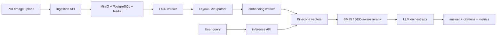

# Enterprise Multimodal RAG Platform

Multiservice document intelligence prototype for OCR, LayoutLMv3 layout parsing, vector retrieval, LLM orchestration, monitoring, and reproducible benchmarking/evaluation.

The project is best read as a technical case study: it combines service code, offline benchmarks, and a local public-corpus SEC evaluation. It is not presented as a production deployment, a legal/financial correctness system, or a customer-data benchmark.

## What This Project Demonstrates

- Async document ingestion with Redis queues, MinIO object storage, PostgreSQL metadata, and worker status updates.
- OCR processing for PDFs/images through EasyOCR.
- Layout-aware document processing with LayoutLMv3 token classification code.
- Tenant-scoped vector indexing and retrieval through Pinecone.
- Hybrid retrieval reranking that combines vector candidate scores with BM25 lexical scores, plus opt-in SEC metadata-aware reranking for the public SEC section benchmark.
- Labeled synthetic retrieval benchmark comparing vector-only, BM25-only, and hybrid reranking strategies with Recall@k, MRR, and nDCG.
- Real-service document RAG evaluation harness for curated local PDF corpora, with manifest validation, ingestion runs, Pinecone retrieval evaluation, optional answer proxy evaluation, and JSON/Markdown reports.
- Public corpus acquisition tooling for CUAD legal contracts and SEC EDGAR financial filings, generating manifest-compatible corpora without committing raw files.
- Public-safe synthetic PDF corpus generator for smoke-testing PDF ingestion workflow readiness.
- Preflight and report-promotion tooling for safer local document RAG evaluation runs.
- LLM prompt selection for legal contracts and financial reports.
- Cost-aware LLM routing between Gemini and Mistral using typed complexity scoring.
- LLM fallback, response caching, citation extraction, confidence scoring, and token/cost accounting.
- Reliability mechanisms including rate limiting, semaphores, retries, circuit breaker state, context sanitization, and task fail paths.
- Prometheus/Grafana monitoring configuration and service-level Prometheus metrics.
- Reproducible mock LLM routing benchmark with fixed workload, baselines, JSON/Markdown evidence, and tests.

## Architecture Summary

The platform is split into ingestion, OCR/layout workers, embedding generation, inference API, LLM orchestration, and monitoring services. Docker Compose wires these services to Redis, PostgreSQL, MinIO, Pinecone, MLflow, Prometheus, Grafana, and a local Mistral-compatible inference server.



See:

- `docs/architecture.md`
- `docs/case-study.md`
- `docs/repository-guide.md`
- `docs/llm-routing-benchmark.md`
- `benchmarks/corpora/README.md`
- `benchmarks/results/retrieval_benchmark_latest.md`

## How The System Works

1. A document is uploaded to the ingestion service with a tenant ID and document type.
2. The ingestion service validates the file, stores the raw object in MinIO, writes metadata/status records, and queues OCR work in Redis.
3. OCR and layout workers process the document asynchronously and queue embedding work.
4. The embedding worker chunks extracted text/layout output, embeds chunks, and writes tenant-scoped vectors to Pinecone.
5. A query request goes through authentication, rate limits, query caching, vector retrieval, BM25 reranking, and context construction in the inference API.
6. The inference API calls the LLM orchestrator, which selects a prompt/model path, calls the provider wrapper, extracts citation markers, estimates token/cost fields, and returns the response.
7. Benchmarks and corpus harnesses exercise these pieces in mock/offline mode or against explicitly configured local services.

## Repository Map

| Path | Purpose |
|---|---|
| `services/ingestion/` | Upload API, document metadata, OCR worker, and queue integration. |
| `services/layout-parser/` | LayoutLMv3-based layout parsing worker. |
| `services/embedding/` | Text/layout chunking, sentence-transformer embeddings, and Pinecone writes. |
| `services/inference-api/` | Query API, auth/rate limiting, vector retrieval, BM25/SEC reranking, context construction, LLM calls. |
| `services/llm-orchestrator/` | Prompt selection, typed complexity scoring, model routing, provider wrappers, caching, citation extraction. |
| `benchmarks/` | LLM routing benchmark, synthetic retrieval benchmark, public-corpus acquisition, SEC labeling/enrichment, document RAG harness, report promotion. |
| `benchmarks/corpora/` | Corpus manifests, source registry, synthetic manifest, and selected sanitized SEC report summaries. Raw local corpora stay ignored. |
| `tests/` | Unit and benchmark tests for routing, hybrid retrieval, corpus manifests, SEC labeling/enrichment, and report tooling. |
| `docs/` | Architecture notes, case study, routing benchmark methodology, and repository guide. |
| `monitoring/` and `services/monitoring/` | Prometheus/Grafana configuration and monitoring service modules. |
| `infrastructure/` | Kubernetes/Terraform scaffolding. This is not presented as production validation. |

## Quickstart

Create and activate a Python environment, then install dependencies:

```powershell
python -m venv .venv
.\.venv\Scripts\Activate.ps1
pip install -r requirements.txt -r requirements-dev.txt
```

Run deterministic tests that do not require external API keys:

```powershell
pytest tests\unit\test_llm_routing.py -q
pytest tests\benchmark\test_llm_routing_benchmark.py -q
pytest tests\benchmark\test_retrieval_benchmark.py -q
```

Run the mock LLM routing benchmark:

```powershell
python benchmarks\llm_routing_benchmark.py --output-dir benchmarks\results --run-id mock_latest
```

Run the synthetic offline retrieval benchmark:

```powershell
python benchmarks\retrieval_benchmark.py --output-dir benchmarks\results --run-id latest
```

Review the checked-in benchmark evidence:

- `benchmarks/results/llm_routing_benchmark_mock_latest.json`
- `benchmarks/results/llm_routing_benchmark_mock_latest.md`
- `benchmarks/results/retrieval_benchmark_latest.json`
- `benchmarks/results/retrieval_benchmark_latest.md`

## Required Services

For the full Docker Compose stack:

- PostgreSQL for document metadata and MLflow backend storage.
- Redis for queues, cache, rate-limit windows, and circuit breaker state.
- MinIO for object storage and local MLflow artifacts.
- Pinecone for vector retrieval.
- MLflow for training/benchmark tracking hooks.
- Prometheus and Grafana for metrics and dashboards.
- Mistral-compatible local inference endpoint through vLLM.
- Gemini API key for Gemini provider calls.

The focused tests, mock LLM benchmark, and synthetic retrieval benchmark listed above do not start these services and do not require real provider credentials.

## Environment Variables

Common variables:

```text
POSTGRES_DB
POSTGRES_USER
POSTGRES_PASSWORD
POSTGRES_URL
REDIS_URL
MINIO_ENDPOINT
MINIO_ROOT_USER
MINIO_ROOT_PASSWORD
MINIO_ACCESS_KEY
MINIO_SECRET_KEY
PINECONE_API_KEY
PINECONE_ENVIRONMENT
PINECONE_INDEX
GEMINI_API_KEY
GEMINI_MODEL_NAME
MISTRAL_API_URL
LLM_ORCHESTRATOR_URL
INGESTION_SERVICE_URL
DOCUMENT_RAG_EVAL_TENANT_ID
DOCUMENT_RAG_EVAL_API_KEY
DOCUMENT_RAG_EVAL_BEARER_TOKEN
DOCUMENT_RAG_EVAL_EMBEDDING_MODEL
PINECONE_NAMESPACE
SEC_USER_AGENT
MLFLOW_TRACKING_URI
PROMETHEUS_URL
GRAFANA_ADMIN_PASSWORD
JWT_SECRET_KEY
API_KEY_PEPPER
```

Use `.env.example` for local defaults. Do not commit `.env` files or real secrets.

## Running Tests

Focused routing tests:

```powershell
pytest tests\unit\test_llm_routing.py -q
```

Benchmark runner tests:

```powershell
pytest tests\benchmark\test_llm_routing_benchmark.py -q
pytest tests\benchmark\test_retrieval_benchmark.py -q
pytest tests\benchmark\test_public_corpus_workflow.py -q
```

Full test suite:

```powershell
pytest
```

Make targets are also available:

```powershell
make test
make test-llm-routing
make test-hybrid-retrieval
make test-benchmark
```

Some integration tests may require external services or heavier ML dependencies. Prefer focused tests when validating LLM routing changes.

## Running Benchmarks

Mock LLM routing benchmark:

```powershell
python benchmarks\llm_routing_benchmark.py --output-dir benchmarks\results --run-id mock_latest
```

Synthetic offline retrieval benchmark:

```powershell
python benchmarks\retrieval_benchmark.py --output-dir benchmarks\results --run-id latest
```

Curated PDF document RAG harness:

```powershell
python benchmarks\e2e_document_rag_eval.py validate-only --manifest benchmarks\corpora\example_manifest.json --skip-file-check
```

Make target:

```powershell
make benchmark-llm-routing
```

The LLM benchmark compares:

- `always_expensive`: Gemini for every query.
- `always_cheap`: Mistral for every query.
- `heuristic`: repository router logic.

The retrieval benchmark compares:

- `vector_only`: deterministic semantic proxy ranking.
- `bm25_only`: BM25 reranking over the same simulated vector candidate pool.
- `hybrid_70_30`, `hybrid_50_50`, and `hybrid_30_70`: score-weight ablations.

Benchmarks write JSON and Markdown reports. CSV is optional for the retrieval benchmark and ignored by `.gitignore`.

## Curated PDF Corpus Evaluation

Raw PDFs should be placed under the ignored local directory:

```text
benchmarks\corpora\local_pdfs\
```

Use `benchmarks\corpora\example_manifest.json` as the manifest template. The manifest is committed, but private PDFs and local generated reports are ignored by default.

Validate a corpus manifest and local PDF references:

```powershell
python benchmarks\e2e_document_rag_eval.py validate-only --manifest benchmarks\corpora\my_manifest.json
```

Run ingestion against a local ingestion service:

```powershell
python benchmarks\e2e_document_rag_eval.py ingest --manifest benchmarks\corpora\my_manifest.json --tenant-id tenant_eval_local --ingestion-url http://localhost:8001 --poll-status --run-id local_ingest
```

Run Pinecone-backed retrieval evaluation after ingestion:

```powershell
python benchmarks\e2e_document_rag_eval.py retrieve --manifest benchmarks\corpora\my_manifest.json --tenant-id tenant_eval_local --pinecone-index doc-intelligence --ingestion-run benchmarks\corpora\results\document_rag_eval_ingest_local_ingest.json --run-id local_retrieve
```

Run optional answer proxy evaluation against the query service:

```powershell
python benchmarks\e2e_document_rag_eval.py answer --manifest benchmarks\corpora\my_manifest.json --tenant-id tenant_eval_local --query-api-url http://localhost:8000 --ingestion-run benchmarks\corpora\results\document_rag_eval_ingest_local_ingest.json --run-id local_answer
```

These commands produce local JSON/Markdown reports under `benchmarks\corpora\results\`. The reports are ignored by default unless a specific, safe report is intentionally selected for review.

## Public Corpus Workflow

Generate a public-safe synthetic PDF smoke corpus:

```powershell
python benchmarks\generate_synthetic_pdf_corpus.py --output-pdf-dir benchmarks\corpora\local_pdfs\synthetic_smoke --manifest-out benchmarks\corpora\synthetic_smoke_manifest.json --overwrite --seed 7 --num-docs 6
```

Prepare a CUAD manifest from local CUAD-style metadata without downloading PDFs:

```powershell
python benchmarks\acquire_public_corpus.py cuad --metadata-json benchmarks\corpora\local_pdfs\cuad_metadata.json --output-pdf-dir benchmarks\corpora\local_pdfs\cuad --manifest-out benchmarks\corpora\cuad_manifest.generated.json --sample-size 10
```

Prepare a SEC EDGAR manifest from local filing metadata without network access:

```powershell
python benchmarks\acquire_public_corpus.py sec-edgar --filings-json benchmarks\corpora\local_pdfs\sec_filings.json --output-file-dir benchmarks\corpora\local_pdfs\sec_edgar --manifest-out benchmarks\corpora\sec_edgar_manifest.generated.json --sample-size 6
```

Fetch SEC filing metadata only when `SEC_USER_AGENT` is set to a real contact string:

```powershell
$env:SEC_USER_AGENT="Your Name your.email@example.com"
python benchmarks\acquire_public_corpus.py sec-edgar --fetch-metadata --ticker AAPL --form-type 10-K --sample-size 1 --manifest-out benchmarks\corpora\sec_edgar_manifest.generated.json
```

Run preflight before service calls:

```powershell
python benchmarks\e2e_document_rag_eval.py preflight --preflight-target retrieve --manifest benchmarks\corpora\synthetic_smoke_manifest.json --pdf-root benchmarks\corpora\local_pdfs
```

Promote a local report into a sanitized public summary:

```powershell
python benchmarks\promote_document_rag_report.py benchmarks\corpora\results\document_rag_eval_retrieve_local.json --output-md benchmarks\corpora\results\sanitized_document_rag_summary.md
```

Make targets mirror these commands: `corpus-generate-synthetic`, `corpus-acquire-cuad`, `corpus-acquire-sec`, `corpus-preflight`, `corpus-validate`, `corpus-ingest`, `corpus-retrieve`, `corpus-answer`, and `corpus-promote-report`.

## Evidence And Benchmark Reports

LLM routing reports include:

- command used
- timestamp
- git commit
- environment summary
- query categories
- selected model per query
- estimated input/output tokens
- estimated cost
- estimated latency p50/p95/p99
- cache hit rate
- fallback count
- quality proxy fields
- limitations

Retrieval reports include:

- command used
- timestamp
- git commit
- environment summary
- dataset paths and query categories
- number of chunks and queries
- selected strategy per query
- Recall@1, Recall@3, Recall@5, MRR, and nDCG@5
- category-level metrics
- top-5 misses and candidate-pool misses
- limitations

Document RAG corpus reports include:

- command used
- timestamp and git commit
- environment summary
- manifest path and PDF root
- corpus document/query counts
- services used, without secrets
- ingestion success/failure counts when ingestion is run
- Recall@1, Recall@3, Recall@5, MRR, and nDCG@5 when retrieval labels are available
- optional answer proxy metrics, including non-empty answer rate, citation presence, and expected-hint overlap
- per-query rows, misses, limitations, and unsupported claims

The current checked-in LLM routing benchmark is mock/synthetic. The current checked-in retrieval benchmark is synthetic/offline and uses simulated vector scores. These reports support reproducibility of the methods, not real production performance.

The curated PDF document RAG harness now includes checked-in sanitized local real-service SEC EDGAR retrieval reports. They are public-corpus, Pinecone-backed, and section-level, but remain environment-specific evidence and must not be described as production retrieval quality.

Current retrieval benchmark evidence from `benchmarks/results/retrieval_benchmark_latest.json`:

| Strategy | Recall@1 | Recall@3 | Recall@5 | MRR | nDCG@5 |
|---|---:|---:|---:|---:|---:|
| vector_only | 0.9000 | 1.0000 | 1.0000 | 0.9667 | 0.9754 |
| bm25_only | 0.8667 | 0.9667 | 1.0000 | 0.9222 | 0.9468 |
| hybrid_70_30 | 0.9667 | 1.0000 | 1.0000 | 1.0000 | 1.0000 |
| hybrid_50_50 | 0.9667 | 1.0000 | 1.0000 | 1.0000 | 1.0000 |
| hybrid_30_70 | 0.9667 | 1.0000 | 1.0000 | 1.0000 | 0.9946 |

Current public SEC section-level retrieval evidence from `benchmarks/corpora/results/sanitized_sec_section_retrieval_v2_summary.md`:

| Corpus | Queries | Label granularity | Namespace | Candidate pool | Candidate misses | Recall@1 | Recall@3 | Recall@5 | MRR | nDCG@5 |
|---|---:|---|---|---:|---:|---:|---:|---:|---:|---:|
| 8 public SEC 10-K filings | 29 | section | `tenant_eval_sec_sections_v2` | 100 | 6 | 0.7586 | 0.7931 | 0.7931 | 0.7759 | 0.7804 |

Previous section baseline from `benchmarks/corpora/results/sanitized_sec_section_retrieval_summary.md`: candidate pool 25, 13 candidate misses, Recall@1 `0.1034`, Recall@3 `0.2759`, Recall@5 `0.3448`, MRR `0.1879`, nDCG@5 `0.2269`.

Interpretation: the v2 run shows that section-aware indexed metadata and SEC-aware reranking materially improve this controlled local SEC section benchmark. It does not prove production retrieval quality, legal correctness, financial correctness, or chunk-level retrieval quality.

Current public SEC answer proxy evidence from `benchmarks/corpora/results/sanitized_sec_section_answer_summary.md`:

| Corpus | Queries | Retrieval setup | Model | Delay/retry handling | Failures | Non-empty answer rate | Required citation presence | Expected-hint overlap |
|---|---:|---|---|---:|---:|---:|---:|---:|
| 8 public SEC 10-K filings | 29 | `tenant_eval_sec_sections_v2`, SEC-aware rerank, candidate pool 100 | Gemini | 15s source run plus failed-query retry at 30s delay, max 1 retry | 16 | 0.448276 | 0.413793 | 0.413793 |

Interpretation: this is a lightweight answer/citation proxy over the same local SEC retrieval setup. The combined v5 report preserves the original 29-query denominator, retries only the 18 failed v4 rows, recovers 2 additional answers, and still records 16 service/provider failures. It does not prove factual, legal, financial, or semantic answer correctness.

## Supported Claims

- The repository contains code for OCR-based document ingestion and LayoutLMv3 layout parsing.
- The repository contains vector retrieval over Pinecone-indexed document chunks plus BM25 reranking over retrieved candidates.
- The repository contains a labeled synthetic retrieval benchmark comparing vector-only, BM25-only, and hybrid reranking strategies.
- The repository contains a real-service evaluation harness for curated PDF corpora, supporting manifest validation, ingestion runs, Pinecone-backed retrieval evaluation, optional answer proxy evaluation, and report generation.
- The repository contains public corpus acquisition tooling for CUAD and SEC EDGAR that generates manifest-compatible corpora while keeping raw files ignored by default.
- The repository contains checked-in sanitized SEC EDGAR section-level retrieval reports from local Pinecone-backed runs, including a v2 SEC-aware reranking ablation with explicit limitations.
- The repository contains a checked-in sanitized SEC EDGAR answer proxy report over the v2 retrieval setup, reporting non-empty answer rate, citation presence, expected-hint overlap, failures, model counts, and limitations.
- The repository contains a public-safe synthetic PDF corpus generator for smoke-testing the PDF ingestion workflow.
- The repository contains preflight and report-sanitization tooling for safer local document RAG evaluation runs.
- The repository contains typed, tested LLM routing with cost-aware model selection.
- The repository contains deterministic tests for routing, prompts, fallback, caching, citations, confidence, cost estimation, and malformed provider responses.
- The repository contains a reproducible mock benchmark comparing LLM routing strategies.
- The repository contains monitoring hooks and Prometheus/Grafana configuration.

## What This Project Does Not Claim

- No production usage is claimed.
- No real users are claimed.
- No uptime, QPS, or SLA is claimed.
- No real cost savings are claimed without real billing/provider evidence.
- No compliance readiness is claimed.
- No production security guarantee is claimed.
- No real LLM answer accuracy is claimed from the mock benchmark.
- No production retrieval quality or real Pinecone performance is claimed from the synthetic retrieval benchmark.
- No real PDF/Pinecone result beyond the checked-in sanitized SEC section-level local retrieval and answer proxy reports is claimed.
- No customer/private document evaluation is claimed.
- No CUAD evaluation result is claimed. No SEC answer correctness result is claimed beyond the checked-in lightweight answer proxy metrics.
- No legal or financial correctness is claimed from the synthetic retrieval benchmark, synthetic PDF smoke corpus, SEC section-level retrieval report, or SEC answer proxy report.
- No claim is made that BM25 is a separate first-stage index; current hybrid retrieval reranks vector candidates with BM25.
- No LayoutLMv3 production accuracy number is claimed.

## Known Limitations

- The LLM benchmark is mock/synthetic and uses estimated latency/cost.
- The synthetic retrieval benchmark is offline and uses simulated vector scores; the SEC report is a separate local Pinecone-backed run.
- The committed SEC retrieval reports are section-level only. The best v2 run still has 6 candidate-pool misses out of 29 queries and does not include chunk-level labels.
- The committed SEC answer proxy report is partial: 16 of 29 queries failed through service/provider failure categories after one failed-query retry pass, and the reported citation/hint metrics are not semantic correctness.
- Public acquisition tooling has not produced a committed CUAD evaluation result in this repository state.
- SEC filings are often HTML and may need local rendering/conversion before PDF ingestion.
- Hybrid retrieval is currently a reranking layer over vector candidates, not a separate first-stage BM25 index.
- Some Docker Compose images use `latest`, which weakens environment reproducibility.
- Full local stack execution requires external services and credentials.
- Real provider benchmark mode is not implemented yet.

## Future Work

These are not current claims; they are practical next steps.

- Add independently reviewed page/chunk labels for the SEC corpus instead of relying only on generated section labels.
- Test whether SEC-aware metadata/reranking generalizes beyond the current 8-filing sample.
- Reduce remaining candidate-pool misses with retrieval changes that are evaluated before/after.
- Add a real-provider benchmark mode with opt-in credentials, clear cost controls, and strict report labeling.
- Broaden CI coverage for corpus manifest validation, report promotion, and retrieval metric utilities.
- Pin remaining `latest` container images to improve environment reproducibility.

## CI

`.github/workflows/test-and-benchmark-smoke.yml` runs deterministic routing tests, hybrid retrieval unit tests, LLM benchmark tests, and the mock LLM benchmark without real API keys or external services. Retrieval benchmark tests can be run locally with `pytest tests\benchmark\test_retrieval_benchmark.py -q`.
