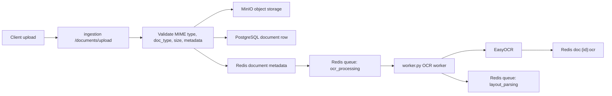
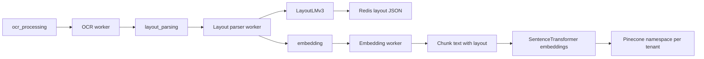
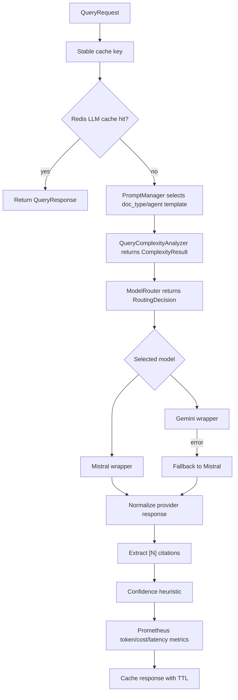

# Architecture

## Service Overview

This repository is organized as a multi-service document intelligence platform:

| Area | Evidence | Responsibility |
|---|---|---|
| Ingestion | `services/ingestion` | Validate uploads, store document objects, persist metadata, enqueue processing jobs. |
| OCR | `services/ingestion/ocr_engine.py` and `services/ingestion/worker.py` | Run EasyOCR over PDFs/images and store extracted text. |
| Layout parsing | `services/layout-parser` | Use LayoutLMv3 token classification to extract document structure. |
| Embeddings | `services/embedding` | Chunk OCR/layout output, generate sentence-transformer embeddings, write vectors to Pinecone. |
| Query API | `services/inference-api` | Authenticate, rate-limit, retrieve context, call LLM orchestrator, cache responses. |
| LLM orchestration | `services/llm-orchestrator` | Select prompt, route model, call provider wrapper, fallback, cache, estimate cost. |
| Monitoring | `monitoring`, `services/monitoring`, Prometheus metrics in services | Export service metrics and provide Prometheus/Grafana configuration. |
| Benchmarks | `benchmarks`, `tests/benchmark` | Reproducible benchmark utilities and smoke tests. |

## Document Ingestion Flow

The ingestion service accepts PDFs and images for `legal_contract` and `financial_report` document types. It stores raw content in MinIO, metadata in PostgreSQL and Redis, and queues OCR work.

## Async Pipeline Flow

Reliability mechanisms in this flow include task acknowledgement, retry/fail handling in `TaskQueue`, worker timeouts, status updates, and error fields on document metadata.

## Query Flow

```mermaid
flowchart LR
  Client["Client query"] --> IA["inference-api /query"]
  IA --> Auth["Auth context and tenant check"]
  Auth --> RL["Rate limit and concurrency controls"]
  RL --> Cache["Redis query cache"]
  Cache -->|hit| Resp["Return cached response"]
  Cache -->|miss| Emb["Encode query"]
  Emb --> Pinecone["Pinecone vector query"]
  Pinecone --> Context["Sanitize and limit context"]
  Context --> LLM["llm-orchestrator /generate"]
  LLM --> Resp
```

The implemented retrieval path is vector retrieval through Pinecone. A repository search found no BM25 implementation yet, so hybrid vector-plus-BM25 retrieval should be treated as a current gap, not a supported claim.

## LLM Routing Flow

The router uses:

- typed complexity output from `ComplexityResult`
- context-length guard for Mistral's configured context limit
- complexity threshold from settings
- explicit force-model support for tests and baselines
- static token cost estimates by model

## Storage And Queue Components

| Component | Use |
|---|---|
| PostgreSQL | Document metadata and status persistence. |
| Redis | Task queues, status/cache data, circuit breaker state, rate-limit windows. |
| MinIO | Raw document object storage and MLflow artifact storage in local compose. |
| Pinecone | Vector index for tenant-scoped document chunks. |
| MLflow | Benchmark/training tracking hooks and LayoutLM pipeline metadata. |

## Monitoring Components

The repository includes:

- Prometheus metrics in ingestion, embedding, layout parsing, inference API, and LLM orchestrator services.
- `monitoring/prometheus/prometheus.yml` and `monitoring/prometheus/alerts.yml`.
- Grafana datasource/dashboard provisioning under `monitoring/grafana`.
- A monitoring service under `services/monitoring` with control-plane and metrics modules.

## Reliability Mechanisms

Implemented mechanisms include:

- upload validation for MIME type, document type, JSON metadata, empty files, and file size
- Redis queue acknowledgement and fail paths
- worker timeouts for OCR/layout tasks
- document status and error persistence
- inference API rate limiting
- per-tenant and global semaphores
- query cache and confidence-based cache TTLs
- context sanitization for prompt-injection patterns
- context-size truncation before LLM calls
- LLM retry loop and Redis-backed circuit breaker in inference API
- LLM fallback from Gemini to Mistral in the orchestrator
- provider response normalization and 502 errors for malformed model payloads

## Current Gaps

- Hybrid retrieval with BM25 is not implemented yet.
- The LLM routing benchmark is mock/synthetic and does not measure real providers.
- LayoutLMv3 code is present, but this documentation does not claim a validated production model accuracy number.
- The compose stack uses some `latest` images; pinning all runtime images would improve reproducibility.
- Security and compliance readiness have not been audited.
