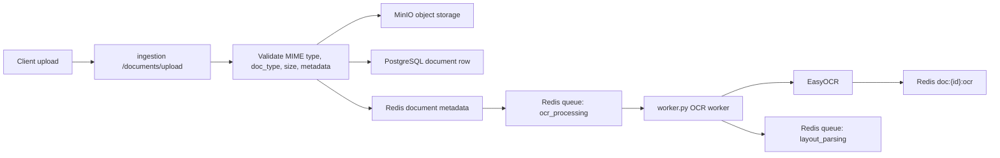
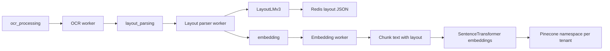
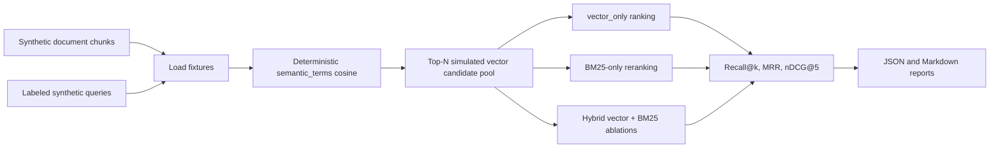
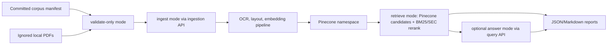
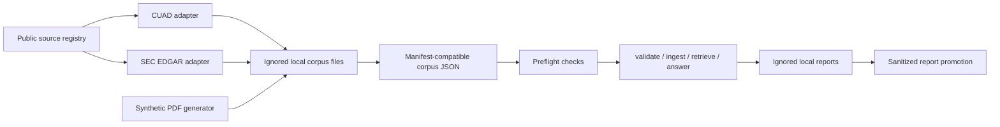
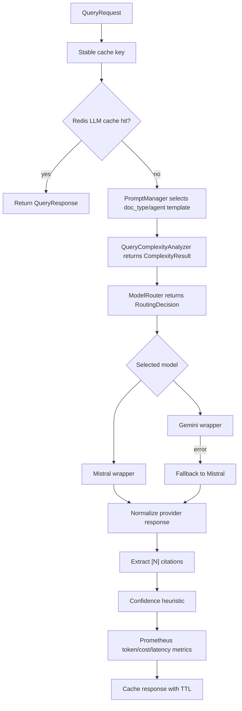

# Architecture

## Service Overview

This repository is organized as a multi-service document intelligence platform:

| Area | Evidence | Responsibility |
|---|---|---|
| Ingestion | `services/ingestion` | Validate uploads, store document objects, persist metadata, enqueue processing jobs. |
| OCR | `services/ingestion/ocr_engine.py` and `services/ingestion/worker.py` | Run EasyOCR over PDFs/images and store extracted text. |
| Layout parsing | `services/layout-parser` | Use LayoutLMv3 token classification to extract document structure. |
| Embeddings | `services/embedding` | Chunk OCR/layout output, generate sentence-transformer embeddings, write vectors to Pinecone. |
| Query API | `services/inference-api` | Authenticate, rate-limit, retrieve context, call LLM orchestrator, cache responses. |
| LLM orchestration | `services/llm-orchestrator` | Select prompt, route model, call provider wrapper, fallback, cache, estimate cost. |
| Monitoring | `monitoring`, `services/monitoring`, Prometheus metrics in services | Export service metrics and provide Prometheus/Grafana configuration. |
| Benchmarks | `benchmarks`, `tests/benchmark` | Reproducible benchmark utilities, labeled synthetic retrieval fixtures, public corpus acquisition, real-service corpus harness, preflight checks, report promotion, and smoke tests. |

## Document Ingestion Flow

The ingestion service accepts PDFs and images for `legal_contract` and `financial_report` document types. It stores raw content in MinIO, metadata in PostgreSQL and Redis, and queues OCR work.

## Async Pipeline Flow

Reliability mechanisms in this flow include task acknowledgement, retry/fail handling in `TaskQueue`, worker timeouts, status updates, and error fields on document metadata.

## Query Flow

```mermaid
flowchart LR
  Client["Client query"] --> IA["inference-api /query"]
  IA --> Auth["Auth context and tenant check"]
  Auth --> RL["Rate limit and concurrency controls"]
  RL --> Cache["Redis query cache"]
  Cache -->|hit| Resp["Return cached response"]
  Cache -->|miss| Emb["Encode query"]
  Emb --> Pinecone["Pinecone vector query"]
  Pinecone --> Hybrid["Rerank: vector + BM25, optional SEC metadata"]
  Hybrid --> Context["Sanitize and limit context"]
  Context --> LLM["llm-orchestrator /generate"]
  LLM --> Resp
```

The retrieval path uses Pinecone for first-stage vector candidates, then reranks those candidates with BM25 lexical scores in `services/inference-api/utils/hybrid_retrieval.py`. For the public SEC section benchmark, an opt-in SEC-aware reranker can additionally use query-visible filing metadata and indexed chunk metadata. This supports bounded retrieval claims: vector retrieval plus BM25 reranking over retrieved candidates, and local SEC section reranking evidence. It is not a separate first-stage BM25 index.

## Retrieval Benchmark Flow

`benchmarks/retrieval_benchmark.py` runs fully offline over:

- `benchmarks/data_samples/retrieval_documents.json`
- `benchmarks/data_samples/retrieval_queries.json`

The benchmark compares vector-only, BM25-only reranking over the same candidate pool, and hybrid score weights. It reports overall metrics, category metrics, per-query top results, candidate-pool misses, and limitations.

The benchmark uses a deterministic semantic proxy rather than Pinecone embeddings. It supports reproducible comparison of retrieval mechanics on labeled synthetic fixtures, not production retrieval quality.

## Document RAG Evaluation Harness Flow

`benchmarks/e2e_document_rag_eval.py` provides the real-service evaluation harness. Raw PDFs live under ignored local paths such as `benchmarks/corpora/local_pdfs/`, while manifests are small committed JSON files that describe document metadata and query labels. Generated reports are written under `benchmarks/corpora/results/` and are ignored by default.

The harness supports:

- `validate-only`: schema and local-file validation without service calls
- `ingest`: upload PDFs to the ingestion API and record per-document status
- `retrieve`: query a configured Pinecone index/namespace, apply the BM25 hybrid reranker or opt-in SEC-aware reranker, and compute Recall@k, MRR, and nDCG when labels are available
- `answer`: optionally call the query API and record lightweight answer proxy metrics

This harness enables local real-service case-study runs over curated PDF corpora. Sanitized SEC EDGAR section-level retrieval reports are checked in, including a v2 SEC-aware reranking ablation, but they remain local public-corpus evidence with explicit limitations, not production retrieval-quality evidence.

## Public Corpus Readiness Flow

Public acquisition code records source attribution and usage notes, but the registry and adapters are not themselves evidence that public documents were downloaded or evaluated. SEC network access requires `SEC_USER_AGENT`; CUAD acquisition requires local dataset review and source-term review. Raw public files and generated local reports remain ignored by default.

## LLM Routing Flow

The router uses:

- typed complexity output from `ComplexityResult`
- context-length guard for Mistral's configured context limit
- complexity threshold from settings
- explicit force-model support for tests and baselines
- static token cost estimates by model

## Storage And Queue Components

| Component | Use |
|---|---|
| PostgreSQL | Document metadata and status persistence. |
| Redis | Task queues, status/cache data, circuit breaker state, rate-limit windows. |
| MinIO | Raw document object storage and MLflow artifact storage in local compose. |
| Pinecone | Vector index for tenant-scoped document chunks. |
| MLflow | Benchmark/training tracking hooks and LayoutLM pipeline metadata. |

## Monitoring Components

The repository includes:

- Prometheus metrics in ingestion, embedding, layout parsing, inference API, and LLM orchestrator services.
- `monitoring/prometheus/prometheus.yml` and `monitoring/prometheus/alerts.yml`.
- Grafana datasource/dashboard provisioning under `monitoring/grafana`.
- A monitoring service under `services/monitoring` with control-plane and metrics modules.

## Reliability Mechanisms

Implemented mechanisms include:

- upload validation for MIME type, document type, JSON metadata, empty files, and file size
- Redis queue acknowledgement and fail paths
- worker timeouts for OCR/layout tasks
- document status and error persistence
- inference API rate limiting
- per-tenant and global semaphores
- query cache and confidence-based cache TTLs
- context sanitization for prompt-injection patterns
- context-size truncation before LLM calls
- LLM retry loop and Redis-backed circuit breaker in inference API
- LLM fallback from Gemini to Mistral in the orchestrator
- provider response normalization and 502 errors for malformed model payloads

## Current Gaps

- Hybrid retrieval is implemented as BM25 reranking over vector candidates; the synthetic benchmark remains offline and separate from the SEC Pinecone report.
- The checked-in SEC reports are section-level only and do not include chunk-level labels or answer correctness evaluation. The best v2 report still has 6 candidate-pool misses out of 29 queries.
- Public CUAD acquisition, preflight, synthetic PDF smoke, and report promotion tooling exist, but no CUAD evaluation report is checked in yet.
- The LLM routing benchmark is mock/synthetic and does not measure real providers.
- LayoutLMv3 code is present, but this documentation does not claim a validated production model accuracy number.
- The compose stack uses some `latest` images; pinning all runtime images would improve reproducibility.
- Security and compliance readiness have not been audited.
